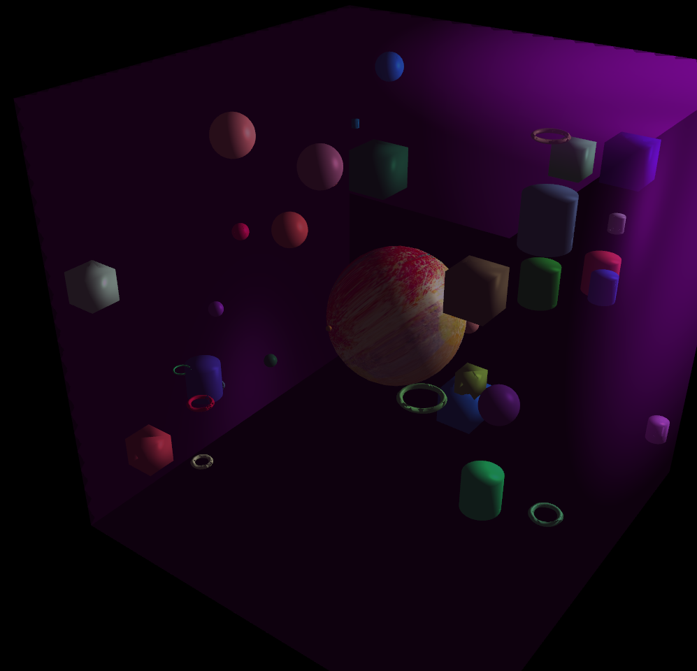

# OpenGL Graphics Project
## About
This project is a 3D Object Collision Demo developed using OpenGL as part of a university Graphics course. It simulates real-time collision detection between objects in a 3D space, applying basic physics principles like velocity, acceleration, and object interaction upon impact. The project also incorporates shaders to handle lighting and surface effects, which enhance the visual representation of the scene. By using collision algorithms like bounding volumes, this demo demonstrates how collisions are managed in 3D environments. The project provided valuable experience in both collision detection and shader programming, essential for modern graphics and game development.
## Installation

To run the **3D Object Collision Demo**, follow these steps:

1. **Clone the Repository**:

    ```bash
    git clone https://github.com/nikos-pap/Lab1-Graphics.git
    ```

2. **Open the Solution in Visual Studio**:
    - Navigate to the project folder.
    - Open the `.sln` file in Visual Studio.

3. **Add Dependencies**:
    - Dependencies are located in the `dependencies` folder.
    - Detailed instructions for adding them to the project can be found in the `dependencies/README.txt` file.

4. **Build and Run**:
    - Once the dependencies are set up, build the project by selecting **Build > Build Solution**.
    - If the build succeeds, run the demo by pressing **F5** or selecting **Debug > Start Debugging**.
## Execution Instructions

Once you run the demo, the program will open in the 3D scene. You can move around the scene, spawn small random shapes, and observe the collisions between the objects in real-time. Use the controls below to navigate and interact with the scene.

### Player Controls

| Action              | Control Key    |
|---------------------|:--------------:|
| **Move** Forward    | `W`            |
| **Move** Backward   | `S`            |
| **Move** Left       | `A`            |
| **Move** Right      | `D`            |
| **Move** Up         | `E`            |
| **Move** down       | `X`            |
| **Rotate** Right    | `L`            |
| **Rotate** Left     | `J`            |
| **Rotate** Up       | `I`            |
| **Rotate** Down     | `K`            |


### Sphere Controls
| Action                 | Control Key    |
|------------------------|:--------------:|
| **Move** Up (+Y)       | `Up Arrow`     |
| **Move** Down (-Y)     | `Down Arrow`   |
| **Move** Left (+X)     | `Left Arrow`   |
| **Move** Right (-X)    | `Right Arrow`  |
| **Move** Forward (+Z)  | `Up Arrow`     |
| **Move** Backwards (-Z)| `Down Arrow`   |
| **Toggle** Texture     | `T`            |


### Game Controls
| Action                 | Control Key    |
|------------------------|:--------------:|
| **Spawn** Random Shape | `Space`        |
| **Decrease** Speed     | `<`            |
| **Increase** Speed     | `>`            |
| **Mute** Sounds        | `M`            |
| **Exit**               | `Esc`          |

**TODO**: 

	- Abstract Renderer from app to compare renderers:
		-- Abstract Renderer class
		-- OpenGLRenderer implements Renderer
			--- Rewrite Shader class to be abstracted from any API specific code. OpenGLShader extends abstract Shader?
				---- Remove every shader reference from ApplicationController. Move to 
			--- Find a way to have the same shader utilized for all solutions. Write it in slang and compile it on runtime to HLSL, GLSL, SpirV?
				---- remove uniform variables and replace them with Uniform Buffers, or write the render function to batch render the objects and use SSBOs.
		-- VulkanRenderer implements Renderer
	- Modernize code
		-- Utilize modern OpenGL (Direct State Access)
		-- Utilize modern C++ features (RAII, coroutines?)
		-- Utilize dynamic link libraries instead of a monolithic exe
	- Fix InputController for Windows 11

-ShapeFactory: 

DONE:	- Implemented OpenGLRenderer class. Using renderer pointer to a OpenGLRenderer obj.
	- Removed OpenGL functions from ApplicationController, DynamicShapeArray and ShapeFactory, moved to OpenGLRenderer.
	- Added Shape.h file to hold Shape struct. Removed any OpenGL specific information (vao, vbo, ibo), and integrated it to OpenGLRenderer.
	

